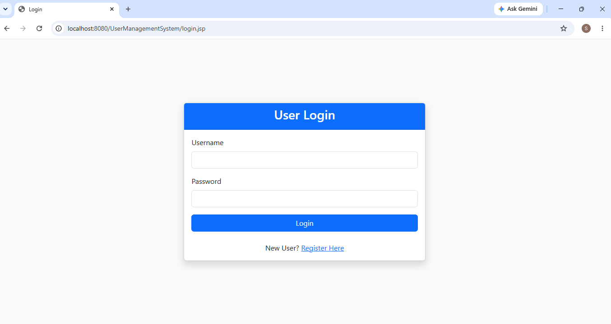
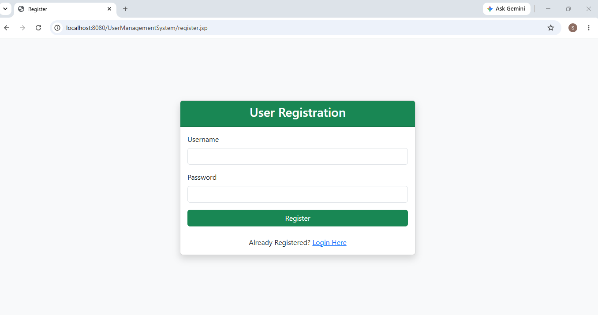
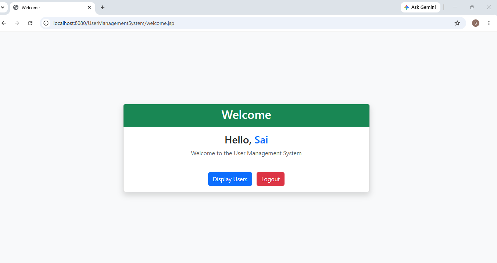
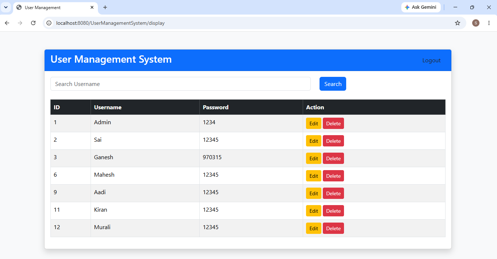
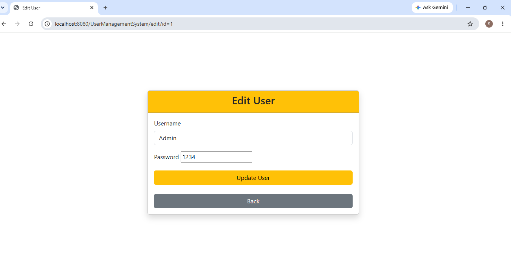

# User Management System

A Java Web Application developed using **JSP, Servlets, JDBC, and MySQL** following the **MVC (Model-View-Controller) Architecture** and **DAO (Data Access Object) Design Pattern**.

The application allows users to register, log in, search, update, and delete user records while maintaining secure session management.

---

## Technologies Used

- Java
- JSP (JavaServer Pages)
- Servlets
- JDBC
- MySQL
- Apache Tomcat 10.1
- HTML5
- CSS3
- Bootstrap 5
- MVC Architecture
- DAO Design Pattern
- Eclipse IDE
- Git
- GitHub

---

## Features

- User Registration
- User Login Authentication
- User Logout
- Session Management
- Display All Users
- Search Users
- Edit User Information
- Update User Information
- Delete User
- Responsive User Interface
- JDBC Database Connectivity

---

## Project Architecture

```
Browser
   │
   ▼
JSP Pages (View)
   │
   ▼
Servlets (Controller)
   │
   ▼
UserDAO (DAO Layer)
   │
   ▼
JDBC
   │
   ▼
MySQL Database
```

---

## Project Structure

```
UserManagementSystem
│
├── src/main/java
│   ├── com.demo.controller
│   │   ├── LoginServlet.java
│   │   ├── RegisterServlet.java
│   │   ├── DisplayServlet.java
│   │   ├── SearchServlet.java
│   │   ├── EditServlet.java
│   │   ├── UpdateServlet.java
│   │   ├── DeleteServlet.java
│   │   └── LogoutServlet.java
│   │
│   ├── com.demo.dao
│   │   └── UserDAO.java
│   │
│   ├── com.demo.model
│   │   └── User.java
│   │
│   ├── com.demo.util
│   │   └── DBConnection.java
│   │
│   └── com.demo.test
│       └── TestConnection.java
│
├── src/main/webapp
│   ├── login.jsp
│   ├── register.jsp
│   ├── users.jsp
│   ├── edit.jsp
│   └── css
│
└── README.md
```

---

## Database

**Database Name**

```
userdb
```

**Table Name**

```
users
```

---

## Screenshots

### Login Page



### Registration Page



### Welcome Page



### User List



### Edit User



---

## How to Run the Project

1. Clone the repository.

```bash
git clone https://github.com/SaiGaneshY/User-Management-System.git
```

2. Open the project in Eclipse IDE.

3. Configure Apache Tomcat 10.1.

4. Create the MySQL database `userdb` and the `users` table.

5. Update the database username and password in **DBConnection.java**.

6. Run the project on Apache Tomcat.

7. Open your browser and visit:

```
http://localhost:8080/UserManagementSystem/login.jsp
```

## Author

**Sai Ganesh**

Java Full Stack Developer

GitHub: https://github.com/SaiGaneshY

---

## License

This project is intended for learning and educational purposes only.
